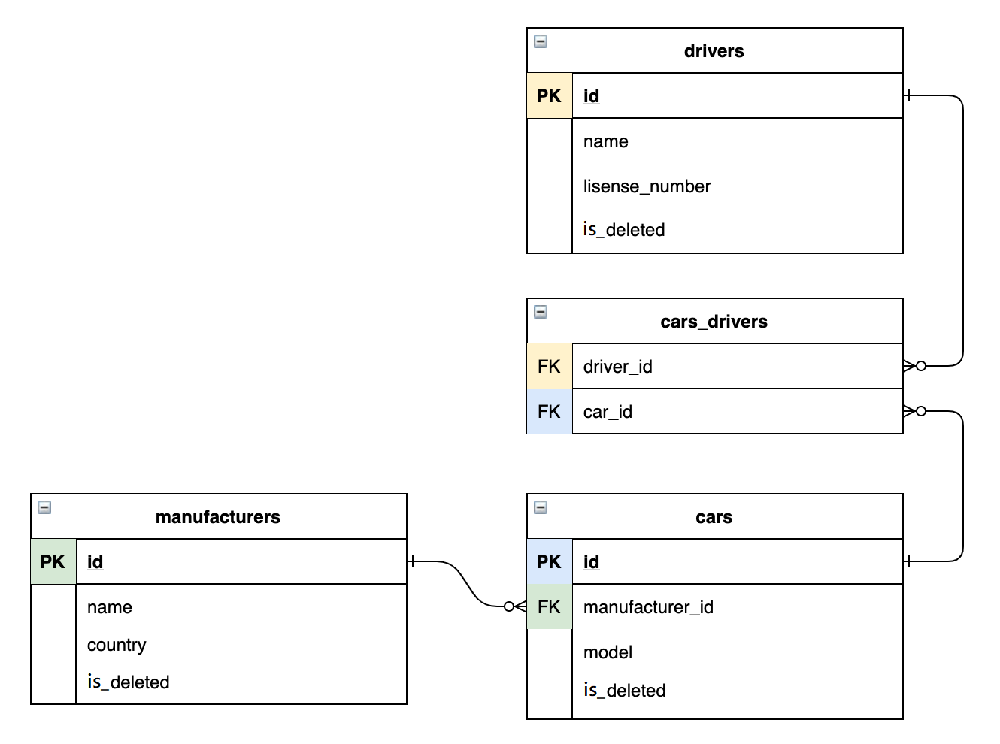

# Taxi Service
### Overview
This is a simple and minimalistic taxi application, designed to showcase my experience working with various Java web development technologies

#### Functionality
- driver authentication
- creating, displaying and deleting manufacturers, cars and drivers
- assigning drivers to cars
- displaying available cars for currently authorized user
---
### What's under the hood

#### Core of the project is 3-layered architecture, implemented following SOLID principles:

- Data access layer: DAO
- Business logic layer: Services
- Presentation layer: Controllers

#### Main technologies:
- Java 11
- pure JDBC + MySQL
- Servlets
- JSP + JSTL
- HTML + CSS

#### Additional technologies:
- Apache Tomcat
- Maven
- Log4j2

### This diagram illustrates relations between entities in DB

---
### How to Run This Project

#### Tools needed:

- IntelliJ IDEA Ultimate IDEA
- ApacheTomcat Tomcat
- MySQL and MySQL Workbench MySQL

1. Clone the project on your IDE
2. Run the script from resources/init_db_my.sql
Warning! if you already have a DB named "taxi", this script will delete it and create a new empty DB with the same name.
3. In src/main/java/taxi/util/ConnectionUtil replace URL, USERNAME, PASSWORD stubs with your properties. 
4. Due to some logging issues, please, in the src/main/resources/log4j2.xml at line File name = "File" fileName = "logs\app.log" replace "logs\app.log" with absolute path to .log file
5. Configure TomCat Local server
   (Add New Configuration -> TomCat -> Local -> Fix -> taxi-service:war exploded -> OK)
6. Run project!
---